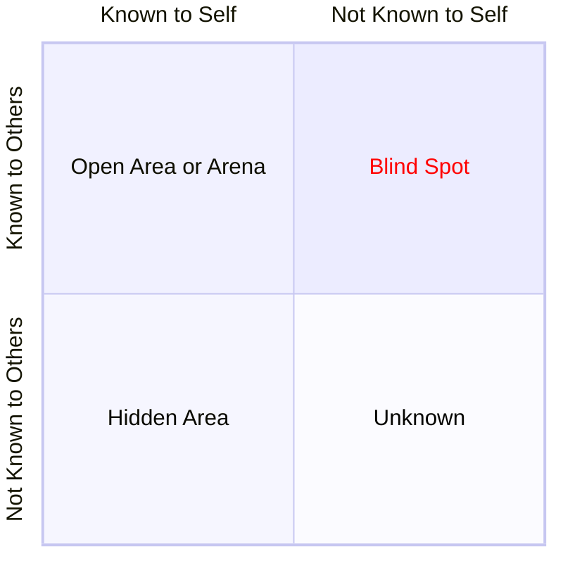

The Johari Window is designed to improve self-awareness and personal development among individuals when they are in a group. It was invented by American psychologist Joseph Luft and Harry Ingham in 1955. The name _Johari_ cames from joining their first two names. You can use the following mermaid code in order to visualize the Johari window at the [Mermaid Live Editor](): 

### **Structure of the Johari Window**
The Johari Window is divided into four quadrants or panes, representing aspects of self-awareness and the relationship between what is known and unknown by oneself and others:

#### 1. Open Area (Arena) 🪟
   - **Known to self** and **known to others**.
   - Represents information about yourself that you and others are aware of, such as behaviors, attitudes, skills, and feelings you openly share.
   - Goal: Expand this area through communication and transparency to foster trust and collaboration.

#### 2. Blind Area (Blind Spot)👁️‍🗨️
   - **Unknown to self** but **known to others**.
   - Represents information others perceive about you but you are unaware of, such as habits, weaknesses, or personality traits.
   - Goal: Reduce this area by seeking feedback and being open to constructive criticism. 🗣️

#### 3. Hidden Area (Façade) 🤐
   - **Known to self** but **unknown to others**.
   - Represents personal information you choose not to reveal, such as fears, insecurities, or private thoughts.
   - Goal: Decrease this area by building trust and sharing selectively to foster deeper relationships.

#### 4. Unknown Area 🌀
   - **Unknown to self** and **unknown to others**.
   - Represents aspects of yourself that are yet to be discovered, such as untapped potential, hidden talents, or subconscious feelings.
   - Goal: Reduce this area through exploration, self-discovery, and experimentation.

### What conclusions can be made from this?

The Johari Window highlights that self-awareness is key to growth, encouraging individuals to expand their Open Area through transparency and trust while reducing their Blind Spots by seeking feedback. Sharing personal information from the Hidden Area fosters deeper relationships, while exploring the Unknown Area uncovers hidden talents and potential. Trust and feedback are crucial for building openness and enhancing interpersonal connections, especially within teams, where mutual understanding improves collaboration and reduces conflict. The dynamic nature of the Johari Window underscores the importance of continuous learning, balancing openness and privacy, and embracing feedback for personal and collective growth. 🚀✨
